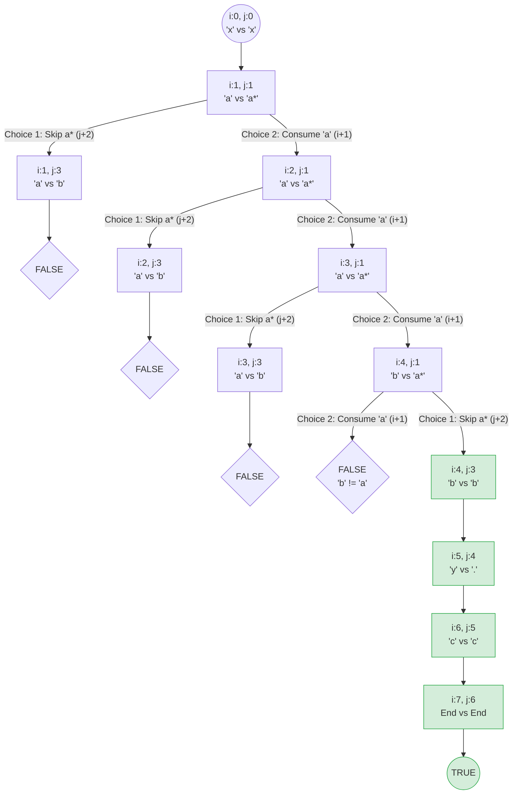

# 10. Regular Expression Matching

#Hard #String #Dynamic Programming

[toc]

## 1. Question

Given an input string `s` and a pattern `p`, implement regular expression matching with support for `'.'` and `'*'` where:

- `'.'` Matches any single character.​​​​
- `'*'` Matches zero or more of the preceding element.

Return a boolean indicating whether the matching covers the entire input string (not partial).

**Example 1:**

> **Input:** s = "aa", p = "a"
> **Output:** false
> **Explanation:** "a" does not match the entire string "aa".

**Example 2:**

> **Input:** s = "aa", p = "a*"
> **Output:** true
> **Explanation:** '*' means zero or more of the preceding element, 'a'. Therefore, by repeating 'a' once, it becomes "aa".

**Example 3:**

> **Input:** s = "ab", p = ".*"
> **Output:** true
> **Explanation:** ".*" means "zero or more (*) of any character (.)".

**Constraints:**

- $$ 1 <= s.length <= 20 $$
- $$ 1 <= p.length <= 20 $$
- `s` contains only lowercase English letters.
- `p` contains only lowercase English letters, `'.'`, and `'*'`.
- It is guaranteed for each appearance of the character `'*'`, there will be a previous valid character to match.
## 2. Solution

### 1) Interative Bottom-up

- Time Complexity: $$ O(mn) $$
- Space Complexity: $$ O(n) $$

#### A. C++

- Runtime: 0 ms
- Memory: 8.36MB

```C++
class Solution {
public:
    bool isMatch(string s, string p) {
        const int m = s.length(), n = p.length();
        vector<int> dp(n + 1, 0);
        dp[0] = 1;

        // Initialize first row (empty string s matches pattern p)
        for (int j = 2; j < n + 1; j++) {
            if (p[j - 1] == '*') dp[j] = dp[j - 2];
        }

        for (int i = 1; i < m + 1; i++) {
            int prev = dp[0];
            dp[0] = 0;    // Empty pattern cannot match non-empty string
            for (int j = 1; j < n + 1; j++) {
                const int temp = dp[j];
                if (p[j - 1] == '*') {
                    const int match = (s[i - 1] == p[j - 2] || p[j - 2] == '.');
                    // Two cases:
                    // 1. Zero occurences (empty string) i.e. Zero Match; Treat 'x*' as an empty string.
                    // 2. Current char match AND repeat (running history) i.e. Repeat Match; Treat 'x*' as 'x', 'xx', 'xxx'
                    dp[j] = dp[j - 2] || (match && dp[j]);
                } else {
                    const int match = (s[i - 1] == p[j - 1] || p[j - 1] == '.');
                    dp[j] = match && prev;
                };
                prev = temp;
            };
        };
        return dp[n];
    }
};
```

#### B. Go

- Runtime: 0 ms
- Memory: 3.96 MB

```go
func isMatch(s string, p string) bool {
    m, n := len(s), len(p)
    dp := make([]bool, n + 1)
    dp[0] = true

    for j := 2; j < n + 1; j++ {
        if p[j - 1] == '*' {
            dp[j] = dp[j - 2]
        }
    }

    for i := 1; i < m + 1; i++ {
        prev := dp[0]
        dp[0] = false
        
        for j := 1; j < n + 1; j++ {
            temp := dp[j]
            if p[j - 1] == '*' {
                match := s[i - 1] == p[j - 2] || p[j - 2] == '.'
                dp[j] = dp[j - 2] || (match && dp[j])
            } else {
                match := s[i - 1] == p[j - 1] || p[j - 1] == '.'
                dp[j] = match && prev
            }
            prev = temp
        }
    }

    return dp[n]
}
```

#### C. Python

- Runtime: 7 ms
- Memory: 19.10 MB

```python
class Solution:
    def isMatch(self, s: str, p: str) -> bool:
        m, n = len(s), len(p)
        dp = [False] * (n + 1)
        dp[0] = True

        for j in range(2, n + 1):
            if p[j - 1] == '*':
                dp[j] = dp[j - 2]

        for i in range(1, m + 1):
            prev = dp[0]
            dp[0] = False
            for j in range(1, n + 1):
                temp = dp[j]
                if p[j - 1] == '*':
                    match = (s[i - 1] == p[j - 2] or p[j - 2] == '.')
                    dp[j] = dp[j - 2] or (match and dp[j])
                else:
                    match = (s[i - 1] == p[j - 1] or p[j - 1] == '.')
                    dp[j] = match and prev
                prev = temp
                
        return dp[n]
            
```

#### D. Illustration

##### d. s= 'xaaabyc', p = 'xa*b.c'

(i)


(ⅱ)


(ⅲ)


(ⅳ)


(ⅴ)


(ⅵ)


(ⅶ)


(ⅷ)


### 2) Recursive Top-down

- Time Complexity: $$ O(mn) $$
- Space Complexity: $$ O(mn) $$

#### A. C++

- Runtime: 1 ms
- Memory: 8.85MB

```C++
class Solution {
public:
    bool isMatch(string s, string p) {
        const int m = s.length();
        const int n = p.length();
        // Use a 2D vector sized (m+1) x (n+1) initialized to -1
        vector<vector<int>> memo(m + 1, vector<int>(n + 1, -1));
        return solve(0, 0, s, p, memo);
    }

private:
    bool solve(int i, int j, const string& s, const string& p, vector<vector<int>>& memo) {
        // Check cache
        if (memo[i][j] != -1) return memo[i][j];

        // Base Case: Pattern is exhausted
        if (j == p.length()) {
            return i == s.length();
        }

        // Check current character match
        bool first_match = (i < s.length() && (p[j] == s[i] || p[j] == '.'));

        bool res;
        // Check for '*' wildcard
        if (j + 1 < p.length() && p[j + 1] == '*') {
            // Choice 1: Skip the 'x*' (move j by 2)
            // Choice 2: Consume 1 char of s and keep 'x*' (move i by 1)
            res = solve(i, j + 2, s, p, memo) || 
                  (first_match && solve(i + 1, j, s, p, memo));
        } else {
            // Standard single character match
            res = first_match && solve(i + 1, j + 1, s, p, memo);
        }

        return memo[i][j] = res;
    }
};
```

#### B. Go

- Runtime: 0 ms
- Memory: 5.02 MB

```go
func isMatch(s string, p string) bool {
    memo := make(map[[2]int]bool)
    
    var dp func(i, j int) bool
    dp = func(i, j int) bool {
        if val, ok := memo[[2]int{i, j}]; ok {
            return val
        }
        
        if j == len(p) {
            return i == len(s)
        }

        firstMatch := i < len(s) && (p[j] == s[i] || p[j] == '.')

        var res bool
        if j+1 < len(p) && p[j + 1] == '*' {
            res = dp(i, j + 2) || (firstMatch && dp(i + 1, j))
        } else {
            res = firstMatch && dp(i + 1, j + 1)
        }

        memo[[2]int{i, j}] = res
        return res
    }

    return dp(0, 0)
}
```

#### C. Python

- Runtime: 3 ms
- Memory: 20.86 MB

```python
class Solution:
    def isMatch(self, s: str, p: str) -> bool:
        
        # lru_cache automatically stores the results of (i, j)
        @lru_cache(None)
        def dp(i: int, j: int) -> bool:
            if j == len(p):
                return i == len(s)

            first_match = i < len(s) and (p[j] == s[i] or p[j] == '.')

            if j + 1 < len(p) and p[j + 1] == '*':
                return dp(i, j + 2) or (first_match and dp(i + 1, j))
            else:
                return first_match and dp(i + 1, j + 1)

        return dp(0, 0)
```
#### D. Illustration

##### d. s= 'xaaabyc', p = 'xa*b.c'

1. process table

| **Step** | **i (s)** | **j (p)** | **Characters**  | **Logic & Decision**                                   | **Result**               |
| -------- | --------- | --------- | --------------- | ------------------------------------------------------ | ------------------------ |
| **1**    | 0         | 0         | `'x'` vs `'x'`  | `p[1]` is `'a'`, not `*`. Direct match. Move both.     | Call `solve(1, 1)`       |
| **2**    | 1         | 1         | `'a'` vs `'a*'` | `p[2]` is `*`. **Branching point.**                    | `res = Skip OR Consume`  |
| **2a**   | 1         | 3         | `'a'` vs `'b'`  | **Skip `a*`**: `p[j+2]`. `'a'` != `'b'`.               | `false`                  |
| **2b**   | 2         | 1         | `'a'` vs `'a*'` | **Consume `a`**: `first_match` is true. Stay at `j=1`. | Call `solve(2, 1)`       |
| **3**    | 2         | 1         | `'a'` vs `'a*'` | `p[2]` is `*`. **Branching point.**                    | `res = Skip OR Consume`  |
| **3a**   | 2         | 3         | `'a'` vs `'b'`  | **Skip `a*`**: `'a'` != `'b'`.                         | `false`                  |
| **3b**   | 3         | 1         | `'a'` vs `'a*'` | **Consume `a`**: `first_match` true.                   | Call `solve(3, 1)`       |
| **4**    | 3         | 1         | `'a'` vs `'a*'` | `p[2]` is `*`. **Branching point.**                    | `res = Skip OR Consume`  |
| **4a**   | 3         | 3         | `'a'` vs `'b'`  | **Skip `a*`**: `'a'` != `'b'`.                         | `false`                  |
| **4b**   | 4         | 1         | `'b'` vs `'a*'` | **Consume `a`**: `first_match` is **False** (b != a).  | `false`                  |
| **5**    | -         | -         | **Backtrack**   | Returning to Step 4... 4b is false, 4a is false.       | `solve(3, 1)` is `false` |

| **Step**      | **i (s)** | **j (p)** | **Chars**       | **Logic**                                               | **Result**    |
| ------------- | --------- | --------- | --------------- | ------------------------------------------------------- | ------------- |
| **4 Revised** | 4         | 1         | `'b'` vs `'a*'` | `first_match` is False (b != a). Skip is the only hope. | `solve(4, 3)` |
| **5**         | 4         | 3         | `'b'` vs `'b'`  | Direct match.                                           | `solve(5, 4)` |
| **6**         | 5         | 4         | `'y'` vs `'.'`  | `'.'` matches everything. `first_match` is True.        | `solve(6, 5)` |
| **7**         | 6         | 5         | `'c'` vs `'c'`  | Direct match.                                           | `solve(7, 6)` |
| **8**         | 7         | 6         | `EOF`           | `j == p.length()` and `i == s.length()`.                | **TRUE**      |
2. flow chart


3. result table (→ imgs)

| **i∖j**     | **0 (x)** | **1 (a)** | **2 (*)** | **3 (b)** | **4 (.)** | **5 (c)** | **6 (End)** |
| ----------- | --------- | --------- | --------- | --------- | --------- | --------- | ----------- |
| **0 (`x`)** | **1**     | -1        | -1        | -1        | -1        | -1        | 0           |
| **1 (`a`)** | 0         | **1**     | -1        | 0         | -1        | -1        | 0           |
| **2 (`a`)** | 0         | **1**     | -1        | 0         | -1        | -1        | 0           |
| **3 (`a`)** | 0         | **1**     | -1        | 0         | -1        | -1        | 0           |
| **4 (`b`)** | 0         | **1**     | -1        | **1**     | 0         | -1        | 0           |
| **5 (`y`)** | 0         | 0         | -1        | 0         | **1**     | 0         | 0           |
| **6 (`c`)** | 0         | 0         | -1        | 0         | 0         | **1**     | 0           |
| **7 (End)** | 0         | 0         | -1        | 0         | 0         | 0         | **1**       |


## Reference

1. LeetCode [10. Regular Expression Matching]
   - https://leetcode.com/problems/regular-expression-matching/
2. LeetCode Solutions [10. Regular Expression Matching] by P.-Y. Chen
   - https://walkccc.me/LeetCode/problems/10/
